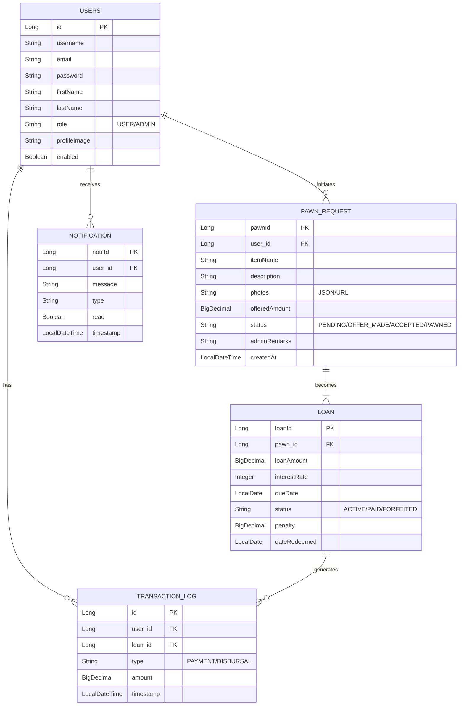

# Entity Relationship Diagram (ERD)

## Schema Overview
The database consists of 5 main tables: `users`, `pawn_request`, `loan`, `notification`, and `transaction_log`.

### Mermaid Diagram

## Key Relationships
1.  **User to PawnRequest (1:N)**: A single user can have multiple pawn requests.
2.  **PawnRequest to Loan (1:1)**: A pawn request becomes exactly one Loan once validated. The `pawn_id` allows tracking the item's journey from request to loan.
3.  **Loan to TransactionLog (1:N)**: A loan can have multiple associated transactions (e.g., initial payout, partial payments, full redemption).

## Data Dictionary

| Table | Column | Type | Description |
| :--- | :--- | :--- | :--- |
| **users** | `role` | ENUM | Distinguishes between 'USER' (Customer) and 'ADMIN' (Staff). |
| **pawn_request** | `status` | VARCHAR | Tracks the workflow state. Key states: `OFFER_MADE` (Admin sets price), `ACCEPTED` (User agrees), `PAWNED` (Item is in custody). |
| **loan** | `loanAmount` | DECIMAL | The final principal amount disbursed to the user. |
| **loan** | `dueDate` | DATE | Calculated based on `proposedLoanDuration` (Default 30 days). |
